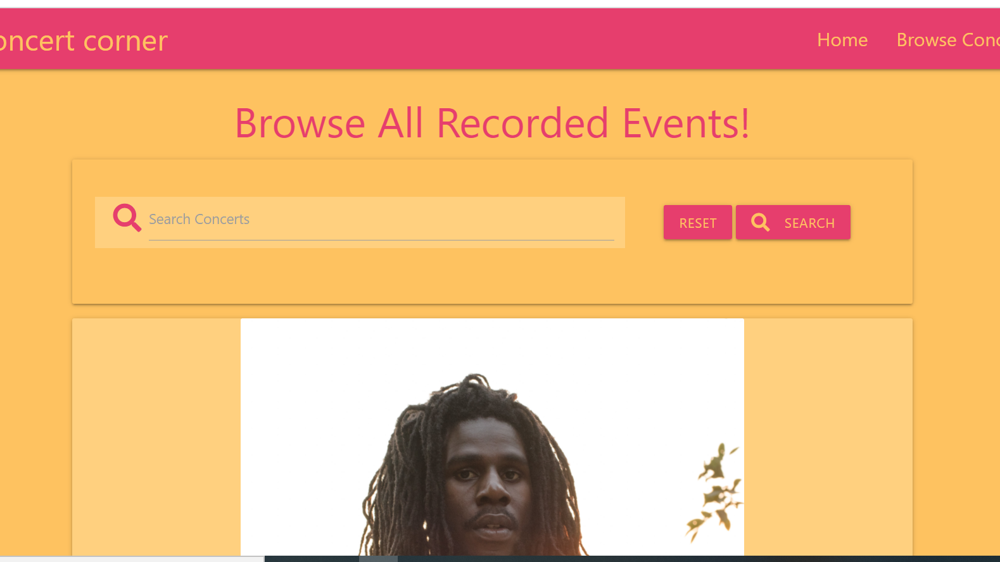
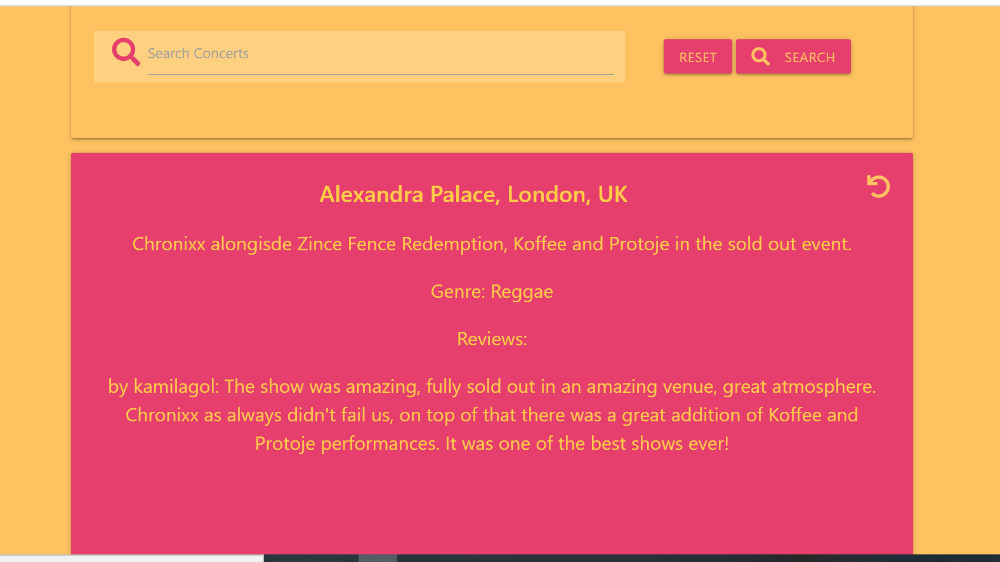
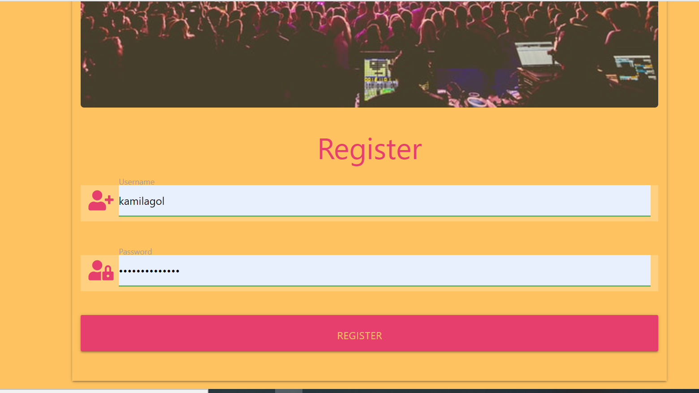
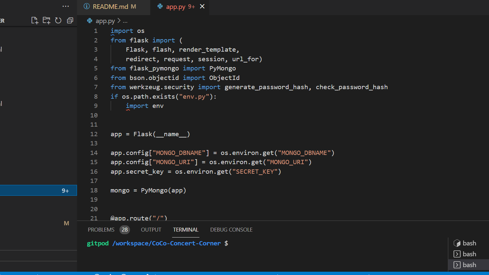
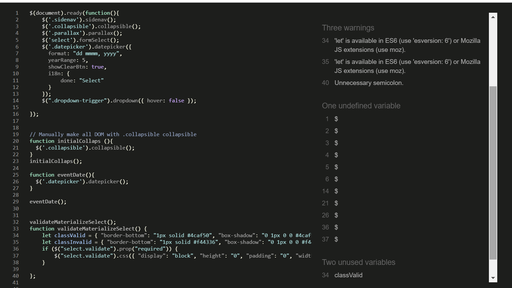
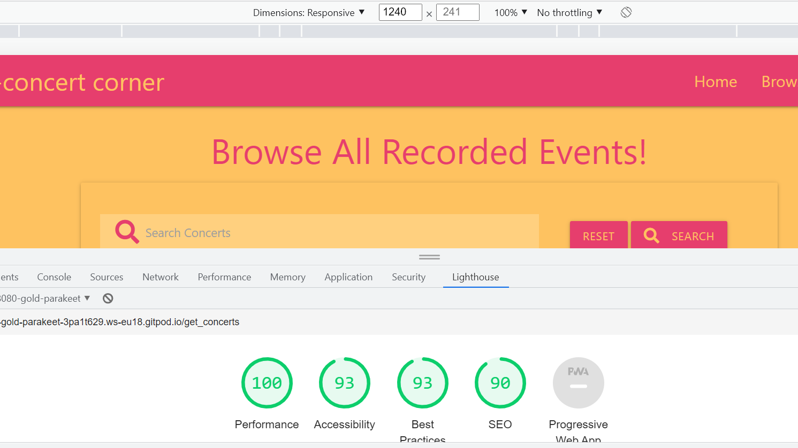
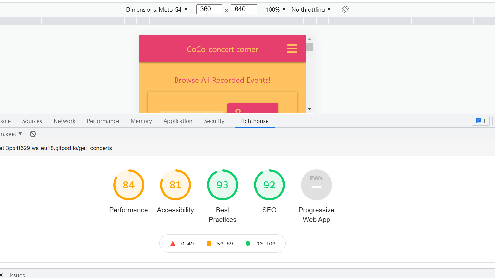

# CoCo- Concert Corner
##  Code created by Kamila Golebiowska for Code Institute
## Languages used: HMTL, CSS, Javascript, Python, Materialize CSS framework, MongoDB, Flask

[CoCo Live Page](https://coco-concert-corner.herokuapp.com/)

## Project description and goals:

Concert corner is a website where you can store all the music events you attended. The main goal is the have all the memories from the music concerts store in one place, where users can review the events and write their own stories about them.

### Navigation Bar & Footer
 Navigation Bar is a simple with a dropdown menu for login and registration and side menu for the mobile devices.
Footer will be pretty basic, containing the copyright only. It will have colors matching the navigation bar.

### Home Page:

Homepage includes simple navbar and a footer in the same color, both taken from Materialize CC. It will contains couple of photos from the live music events.
There will be a small intro icluded with the registration button.

## Browse Concert

Next Page will have a collection of the concerts/events that was put into a database by user. It will be made of cards, with a small photo, data, place of the event. When pressed on the phot there will be more info about the concert and space for reviews. All information will be users information stored in database.

### Register/Login

This section will provide a form where user can create a profile or sign in to already registered profile.

 

 

### Features to add in future
* APIs for each genre that launch the playlists in the particular genres
* Api for the music for each artist
* functionality that double checks the password when registering the profile
* functionality that double checks if the user wants to delete a chosen thing

 ## User Goals

 ### First Time User:

 * if the site looks nice and if it;s easy to manouvre
 * if it's easy to register
 * if it's straight forward to store the events 
 
 ### Returning User
 * if it's easy to login and see the collections of events
 * if I can easily add the reviews to my events

## Wireframes
 [Wireframes]()

## Credits

### Content

All text content was written by me-Kamila Golebiowska. 

### Images 
The images for the website were taken from the [Unsplash](https://unsplash.com/images)

[crowd with the mobile phone](https://unsplash.com/photos/JNuKyKXLh8U)
[crowd with a heart gesture](https://unsplash.com/photos/hzgs56Ze49s)
Artists photos that I put into the new concert form were taken from random websites.
[Chronixx](https://www.caribbeannationalweekly.com/caribbean-breaking-news-featured/chronixx-among-nominees-grammys-best-reggae-album/)
[Children of Zeus](https://www.manchestersfinest.com/music/children-of-zeus-announce-uk-tour/)
[Bjork](https://gif-ac.com/bjork-utopia-70/)
[Arrested Development](https://dfw.cbslocal.com/2016/06/22/raps-arrested-development-still-making-music-on-their-terms/)
[Protoje](https://www.rcarecords.com/news/protoje-unleashes-new-studio-album-in-search-of-lost-time-out-today/)
[Glastonbury](https://meaww.com/taylor-swift-headline-glastonbury-2020-paul-mc-cartney-diana-ross-aerosmith-michael-eavis-emily-eavis)

### Icons and Fonts

Logo and Icons used free icons from [Font Awesome](https://fontawesome.com/?from=io)

### Code

* Whole project was based on the mini walk through project from Code Institute. Whole Python section and its functionality is taken from that project and once the skeleton and all the database conncetions were made, I started to change all the layout, adjusting it to the needs of my project.
I followed once more the videos from the project and was adjusting things o the way. 

* Structure was taken from Materialize CSS framework, using a dropdown menu, footer as well
 
 
* [Stack Overflow](https://stackoverflow.com/)
* [Free Code Camp](https://www.freecodecamp.org/)
* [W3 schools](https://www.w3schools.com/html/default.asp)
* [Random Key](https://randomkeygen.com/)

#### First Steps to set up MONGODb

* First Step was to create the collections in database-MongoDB
 
 
 
* installed Flask and Python libraries, plus created the env.py file to store sensitive data
* connected Github to Heroku to make the deployment automatic.
* wired Flask to MongoDB database, installed flask-pymongo, dnspython and updating requirements,txt file for Heroku
* in app.py file made all the imports and configurations to get info from database
* in MongoDB cluster overview pressed the connect button and chose option to connect with the application, using drivers, where Python is the driver and the version we re working with.
Copied the string underneath to the clipboard, pasted it to the empty space for Mongo_URI in our app.py,we need to add a name of our database there and the password to our dtabase password(not login password).
* the same string will be copied in Heroku settings, with our config var list(check deployment section)

## Handling Bugs and what is remaining
### My struggles

### Existing Bugs

## Testing

[Check responsiveness](http://ami.responsivedesign.is/?url=https%3A%2F%2Fkomfigolabi.github.io%2FExplore-Ethiopia%2F)

[HTML Validator Page](https://validator.w3.org/)

Html validation was throwing errors when used the code from the working environment, so the validation was made by opening the website and using the view source option, when right clicking on the mouse and then validated.
It passed the validation, all pages had the same warning, which refers to the section with flash messages. The rest of the errors has been fixed.

[CSS Validator Page](https://jigsaw.w3.org/css-validator/)
* Code from style.css was copied as a direct input into the CSS validator page and no errors were found.

* 
Google Dev Tool: Lighthouse 

Lighthouse testing was fluctuating slightly due to the course of the project and the photos are showing the final results.

* Website was tested on various browsers: Chrome, Microsoft Edge and Mozzila Firefox and on all of those performed well.
 

 ### First Time User:
* page has an attractive lay out
* it is easy to register, doesn't require any complicated steps
* the design is fresh

 ### Returning User
 * easy to login
 * nice to browse through the events
 * good for adding the reviews
 

## Deployment

1. Created repository with the title of the page "CoCo-concert corner" in GitHub.
2. Created the files in the project required for deployment in Heroku: Procfile and requirements.txt
3. In Heroku web I created a new app and I chose the option that connects GitHub and Heroku, so deploymemt happens automatically, which option Connect to GitHub and choosing the right depository name and pressing Connect button.
3. Before we enable connection went to Settings tab, pressed Reveal Config Vars, where we can tell which variables we need.
4. In the list without the quotation marks I added IP-0.0.0.0, PORT-5000,SECREt_KEY, copieed from env.py file, MONGO_URI and MONGO_DBNAME with the name of our database
5. In coding environment pushed the files created for running Heroku into the repository.
6. Came back to Heroku and pressed Enable Automatic Deployment button and Deploy Branch.

 

 ## Steps to get into the project and how to clone the repository
* Click on the provided link to my Github repository. [Click here for the project](https://github.com/komfiGolabi/CoCo-Concert-Corner-MS3-KamilaGolebiowska)
* Once inside click on the Code button and press either clone or download.
* Under the option HTTP, press the clipboard, that has the link inside and copy it.
* open the terminal you are using for your computer
* choose the location where you would like to store the repo, locally
* in the terminal now you can use the command git clone and the link.

 

