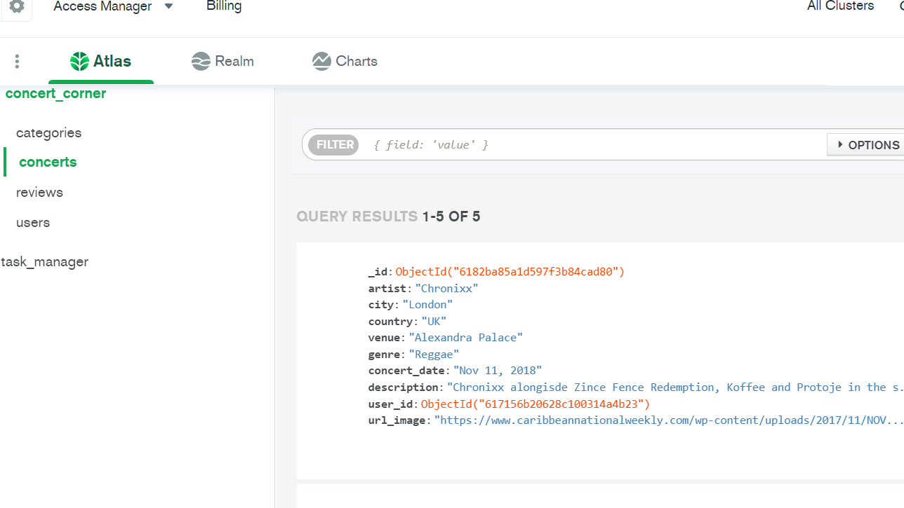

# CoCo- Concert Corner
##  Code created by Kamila Golebiowska for Code Institute
## Languages used: HMTL, CSS, Javascript, Python, Materialize CSS framework, MongoDB, Flask

[CoCo Live Page](https://coco-concert-corner.herokuapp.com/)

## Project description and goals:

Concert corner is a website where you can store all the music events you attended. The main goal is the have all the memories from the music concerts store in one place, where users can review the events and write their own stories about them.

### Navigation Bar
 Navigation Bar is a simple with a dropdown menu for login and registration and side menu for the mobile devices.

###  Footer
Footer will be pretty basic, containing the copyright only. It will have colors matching the navigation bar.

### Home Page:

Homepage includes simple navbar and a footer in the same color, both taken from Materialize CC. It will contains couple of photos from the live music events.
There will be a small intro icluded with the registration button.

## Browse Concert

Next Page will have a collection of the concerts/events that was put into a databae by user. It will be made of cards, with a small photo, data, place of the event, as well as a little description
of the concert. All information will be users information stored in database.

### Register/Login

This section will provide a form where user can create a profile or sign in to already registered profile.

 

 

 ### Features to add in future
* APIs for each genre that launch the playlists in the particular genres
* Api for the music for each artist
* functionality that double checks the password when registering the profile
* functionality that double checks if the user wants to delete a chosen thing

 ## User Goals

 ### First Time User:
 
 ### Returning User

## Wireframes
 [Wireframes]()

## Credits

### Content

All text content was written by me-Kamila Golebiowska. 

### Images 

Hompage:

### Icons and Fonts

Logo and Icons used free icons from [Font Awesome](https://fontawesome.com/?from=io)

### Code

* Whole project was based on the mini walk through project from Code Institute. Whole Python section and its functionality is taken from that project and once the skeleton and all the database conncetions were made, I started to change all the layout, adjusting it to the needs of my project. 

 * Navbar Menu was taken from Materialize CSS framework, using a dropdown menu, footer as well
 * 

 
* [Stack Overflow](https://stackoverflow.com/)
* [Free Code Camp](https://www.freecodecamp.org/)
* [W3 schools](https://www.w3schools.com/html/default.asp)
* [Random Key](https://randomkeygen.com/)

#### Whole process 

* First Step was to create the collections in database-MongoDB
 
 
* installed Flask and Python libraries, plus created the env.py file to store sensitive data

## Handling Bugs and what is remaining
### My struggles

### Existing Bugs

## Testing

[Check responsiveness](http://ami.responsivedesign.is/?url=https%3A%2F%2Fkomfigolabi.github.io%2FExplore-Ethiopia%2F)

[HTML Validator Page](https://validator.w3.org/)

Html validation was throwing errors when used the code from the working environment, so the validation was made by opening the website and using the view source option, when right clicking on the mouse and then validated.
It passed the validation, all pages had the same warning, which refers to the section with flash messages. The rest of the errors has been fixed.

[CSS Validator Page](https://jigsaw.w3.org/css-validator/)
* Code from style.css was copied as a direct input into the CSS validator page and no errors were found.

Google Dev Tool: Lighthouse 

Lighthouse testing was fluctuating slightly due to the course of the project and the photos are showing the final results.

* Website was tested on various browsers: Chrome, Microsoft Edge and Mozzila Firefox and on all of those performed well.
 

 ### First Time User:
* if the page looks attractive
* if it's easy to register a profile
* if I can easily store my events and if it's easy to browse the events
 

 ### Returning User
 * easy access to login to my profile
 * if I can easily edit my events 

## Deployment

1. Created repository with the title of the page "CoCo-concert corner".
 

 ## Steps to get into the project and how to clone the repository

 

